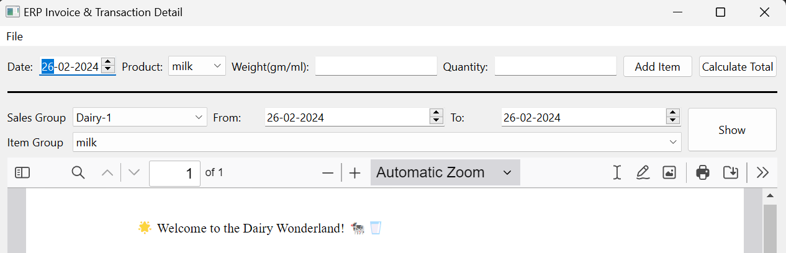

---

#  ERP Management Application

Welcome to the ERP Management Application repository! This Python application provides a comprehensive solution for managing dairy invoices and transaction details. 

## Table of Contents

- [Features](#features)
- [Installation](#installation)
- [Usage](#usage)
- [Screenshots](#screenshots)
- [Contributing](#contributing)
- [License](#license)
- [Acknowledgments](#acknowledgments)

## Features

- **Easy Data Entry:** Quickly add dairy products, their weights, and quantities with a user-friendly interface.
- **Real-time Calculation:** Effortlessly calculate each transaction's total cost, GST, and gross total.
- **Database Storage:** All transactions are securely stored in a DuckDB database, providing a robust data management solution.
- **Dynamic Filtering:** Analyze daily transactions by setting date ranges and filtering by specific dairy products.
- **Invoice Generation:** Generate professional tax invoices with ERP SOLUTIONS Pvt. Ltd branding, utilizing Matplotlib for visual appeal.
- **Data Analysis:** Leverage Matplotlib for data visualization to gain insights into your dairy business.
- **Database Management:** DuckDB ensures efficient and reliable storage, easily scalable as your business grows.
- **Show Daily Transactions:** Explore daily transactions by selecting a specific sales group, date range, and item group.


## Getting Started

1. Clone the repository to your local machine:

   ```bash
   git clone https://github.com/aaleshpatil22/PySide6_Basic.git
   cd PySide6_Basic/ERP_Solutions
   ```

2. Ensure you have Python and PySide6 installed:

   ```bash
   pip install PySide6 matplotlib pandas duckdb
   ```

## Usage

Run the `main.py` script to launch the PySide6 Notepad application:

```bash
python main.py
```

