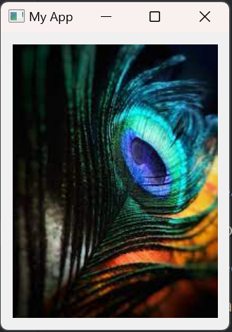

---

#  QPixmap Example

This project demonstrates the usage of the QPixmap element in PySide6, a Python binding for the Qt framework. The `main.py` file creates a simple PySide6 application with a QWidget and QLabel displaying an image using QPixmap.

## Table of Contents

- [Introduction](#introduction)
- [Project Structure](#project-structure)
- [Getting Started](#getting-started)
- [Usage](#usage)
- [Features](#features)
- [Contributing](#contributing)
- [License](#license)

## Introduction

This project showcases the implementation of a PySide6 application utilizing the QPixmap element to display an image on a QLabel. The application features a QWidget containing a QLabel that loads and displays an image using QPixmap.

## Project Structure

- **main.py**: The main Python script that creates the PySide6 application using QPixmap.
- **README.md**: Documentation file providing information about the project.

## Getting Started

1. Clone the repository to your local machine:

   ```bash
   git clone https://github.com/aaleshpatil22/PySide6_Basic.git
   cd PySide6_Basic/Image
   ```

2. Ensure you have Python and PySide6 installed:

   ```bash
   pip install PySide6
   ```

## Usage

1. Place an image file (e.g., `download.jpeg`) in the same directory as `main.py`.
2. Run the `main.py` script to launch the PySide6 application:

   ```bash
   python main.py
   ```

Explore the PySide6 application with a QLabel displaying the loaded image using QPixmap.

## Features

- Usage of QPixmap to load and display an image on a QLabel.

## Contributing

Feel free to contribute to this project by opening issues, suggesting enhancements, or submitting pull requests. Follow the guidelines in [CONTRIBUTING.md](CONTRIBUTING.md).

## License

This project is licensed under the MIT License - see the [LICENSE](../LICENSE.txt) file for details.

---
