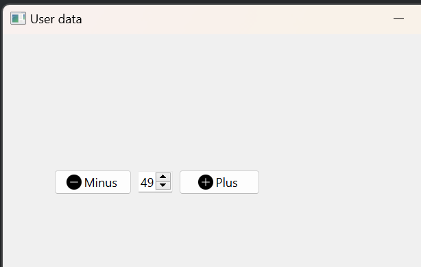

---

#  Counter Application

This project showcases a simple PySide6 application with a counter. The graphical user interface (GUI) includes a spin box, a minus button, and a plus button. The counter value can be adjusted by clicking the buttons or using the spin box.

## Table of Contents

- [Introduction](#introduction)
- [Project Structure](#project-structure)
- [Getting Started](#getting-started)
- [Usage](#usage)
- [Features](#features)
- [Contributing](#contributing)
- [License](#license)

## Introduction

This PySide6 application provides a basic form with a counter that can be incremented or decremented using the provided buttons. The GUI is created using PySide6, providing a simple way to understand the integration of QSpinBox and QPushButton elements.

## Project Structure

- **/CounterApp/main.py**: The main Python script that creates the PySide6 application with a counter.
- **/CounterApp/spin_rc.py**: Resource file (if any) used in the project.
- **/CounterApp/README.md**: Documentation file providing information about the project.

## Getting Started

1. Clone the repository to your local machine:

   ```bash
   git clone https://github.com/aaleshpatil22/PySide6_Basic.git
   cd PySide6_Basic/SpinBox
   ```

2. Ensure you have Python and PySide6 installed:

   ```bash
   pip install PySide6
   ```

## Usage

Run the `main.py` script to launch the PySide6 application:

```bash
python main.py
```

Explore the application to understand how the counter value changes when you click the plus or minus buttons or use the spin box.

## Features

- PySide6 application with a counter.
- Integration of QSpinBox, QPushButton, and a simple form.

## Contributing

Feel free to contribute to this project by opening issues, suggesting enhancements, or submitting pull requests. Follow the guidelines in [CONTRIBUTING.md](CONTRIBUTING.md).

## License

This project is licensed under the MIT License - see the [LICENSE](../LICENSE.txt) file for details.

---
