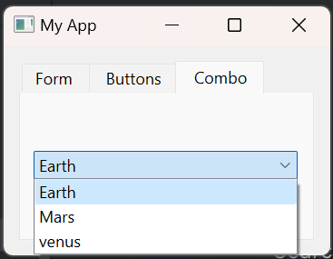

---

#  QTabWidget Example

This project demonstrates the usage of the QTabWidget element in PySide6, a Python binding for the Qt framework. The `main.py` file creates a simple PySide6 application with a QWidget containing QTabWidget, showcasing three tabs - "Form," "Buttons," and "Combo."

## Table of Contents

- [Introduction](#introduction)
- [Project Structure](#project-structure)
- [Getting Started](#getting-started)
- [Usage](#usage)
- [Features](#features)
- [Contributing](#contributing)
- [License](#license)

## Introduction

This project showcases the implementation of a PySide6 application utilizing the QTabWidget element to organize content into multiple tabs. The application features a QWidget with a QTabWidget containing three tabs: "Form" with QLabel and QLineEdit, "Buttons" with QPushButtons, and "Combo" with a QComboBox.

## Project Structure

- **/Tab/main.py**: The main Python script that creates the PySide6 application using QTabWidget.
- **/Tab/README.md**: Documentation file providing information about the project.

## Getting Started

1. Clone the repository to your local machine:

   ```bash
   git clone https://github.com/aaleshpatil22/PySide6_Basic.git
   cd PySide6_Basic/Tab
   ```

2. Ensure you have Python and PySide6 installed:

   ```bash
   pip install PySide6
   ```

## Usage

Run the `main.py` script to launch the PySide6 application:

```bash
python main.py
```

Explore the PySide6 application with QTabWidget and navigate between the "Form," "Buttons," and "Combo" tabs.

## Features

- Implementation of a PySide6 application with QTabWidget.
- Three tabs, each showcasing different elements - "Form" (QLabel and QLineEdit), "Buttons" (QPushButton), and "Combo" (QComboBox).

## Contributing

Feel free to contribute to this project by opening issues, suggesting enhancements, or submitting pull requests. Follow the guidelines in [CONTRIBUTING.md](CONTRIBUTING.md).

## License

This project is licensed under the MIT License - see the [LICENSE](../LICENSE.txt) file for details.

---
