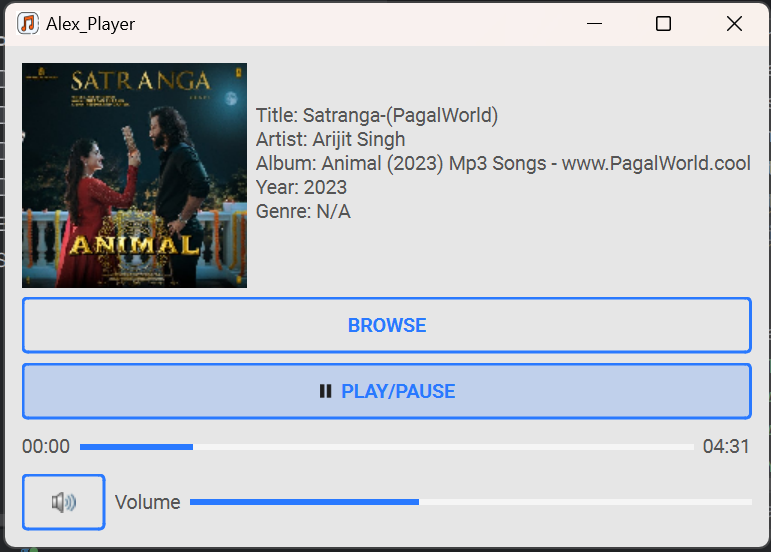

---

#  Music Player Application

Alex Player is a simple music player application written in Python using PySide6 and VLC bindings. It provides a user-friendly interface for playing audio files with features like metadata display, play/pause controls, volume adjustment, and seeking within the song.

## Table of Contents

- [Features](#features)
- [Requirements](#requirements)
- [Installation](#installation)
- [Usage](#usage)

## Features

- Browse and select audio files
- Display metadata information (Title, Artist, Album, Year, Genre)
- Play/Pause functionality with a Play/Pause button
- Volume control with a slider and mute button
- Seek within the song using a position slider
- Display album artwork if available
- Light blue theme using the `qt_material` library

## Requirements

- Python 3.x
- PySide6
- VLC Python bindings (`vlc`)
- `qt_material` library

## Installation

1. Install the required dependencies:

   ```bash
   pip install PySide6 python-vlc qt-material
