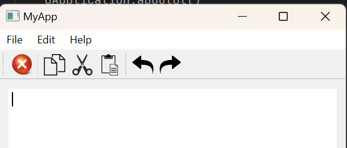

# PySide6 Notepad Application

This project is a simple Notepad application created using PySide6, providing basic text editing functionalities. The application includes features such as copy, cut, paste, undo, redo, and basic file operations.

## Table of Contents

- [Introduction](#introduction)
- [Project Structure](#project-structure)
- [Getting Started](#getting-started)
- [Usage](#usage)
- [Features](#features)
- [Contributing](#contributing)
- [License](#license)

## Introduction

The PySide6 Notepad application is a text editor that allows users to perform common text manipulation tasks. It provides a user-friendly interface with a menu bar, toolbar, and a central text-editing area.

## Project Structure

- **/NotepadApp/main.py**: The main Python script that creates the PySide6 Notepad application.
- **/NotepadApp/app_rcc.py**: Resource file (if any) used in the project.
- **/NotepadApp/README.md**: Documentation file providing information about the project.

## Getting Started

1. Clone the repository to your local machine:

   ```bash
   git clone https://github.com/aaleshpatil22/PySide6_Basic.git
   cd PySide6_Basic/ui_app
   ```

2. Ensure you have Python and PySide6 installed:

   ```bash
   pip install PySide6
   ```

## Usage

Run the `main.py` script to launch the PySide6 Notepad application:

```bash
python main.py
```

Explore the application to create, edit, and save text files using the provided features.

## Features

- Text editing functionalities: copy, cut, paste, undo, redo.
- Basic file operations: open, save, and save as.
- User-friendly interface with a menu bar and toolbar.

## Contributing

Feel free to contribute to this project by opening issues, suggesting enhancements, or submitting pull requests. Follow the guidelines in [CONTRIBUTING.md](CONTRIBUTING.md).

## License

This project is licensed under the MIT License - see the [LICENSE](../LICENSE.txt) file for details.

---
## Application Screenshot



